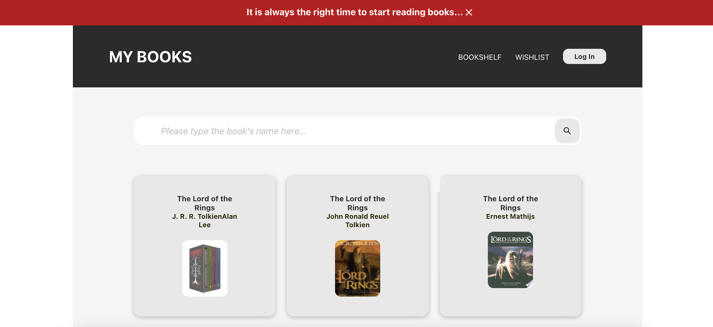

# - My Books App- React Project for Web Development Portfolio 

## My Books -  Digital reading diary 

This app is an example project for my personal web development portfolio. 

My books is a web app made with [React](https://react.dev) and lets users search for any book contained in the [Google Books API](https://developers.google.com/books). Users can save their favorite book to *Wishlist* (if they want to keep track of books that they would like to read in the future) or to *Bookshelf* (if they have already read the book and want to keep a track of all read books). Data for this project is stored locally in the *Local Storage*. 

## Concepts used in this app:  

- useState, useEffect, useContext, useReducer hooks
- props and lifting the state up 
- Modals (pop ups/ overlays)
- React Portals and Fragments
- Routes and NavLink (React Router Dom)
- React Icons
- Fetching API
- Local storage
- Form validation 

## Build with:

- React
- CSS Module

*View and interact with the project [here]()*

This application is built to showcase my understanding of React, alongside the ability to implement JavaScript and CSS module styling.
